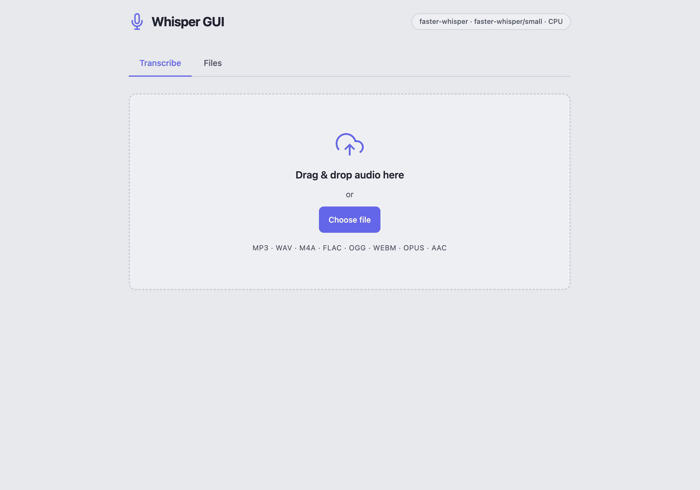

# Whisper GUI

A self-contained, self-hostable speech-to-text web application. Drop in an audio file, get a transcription back. Everything runs locally — no cloud APIs, no data leaving your machine.

Built around a pluggable engine architecture so you can trade off speed, accuracy, and hardware requirements by changing a single environment variable.

<p align="center">
  
</p>

---

## Features

- **Drag-and-drop or file picker** upload (MP3, WAV, M4A, FLAC, OGG, WEBM, OPUS, AAC, WMA)
- **In-browser transcription display** with word count
- **In-browser audio playback** — listen back to your recording alongside the transcript
- **Edit mode** — click Edit to modify the transcript directly in the browser before exporting
- **Copy to clipboard** and **download as `.txt`**
- **Engine info badge** — header shows the active engine, model, and GPU at a glance
- **File browser** — "Files" tab lists all previously uploaded audio with name, size, and upload date
- **Re-transcribe from cache** — re-run transcription on any cached file without re-uploading
- **Pluggable engines** — switch between Whisper, Faster-Whisper, Canary-Qwen, or Qwen2-Audio
- **CPU and GPU** support; GPU engines gracefully refuse to load on CPU-only hosts
- **Model weights cached to a volume** — downloaded once, reused across container restarts
- **Models pre-downloaded at startup** so the first request is instant
- **Live loading page** — startup progress is shown in the browser and the app auto-reloads when ready
- **Audio cache TTL** — uploaded files are automatically purged after a configurable number of hours
- Zero external dependencies at runtime — fully self-hostable

---

## Engines

| Engine | Hardware | Notes |
|---|---|---|
| `faster-whisper` | CPU or GPU | Default. ~4× faster than openai-whisper via CTranslate2. Recommended for most setups. |
| `whisper` | CPU or GPU | Original OpenAI Whisper. Slower but widely tested. |
| `canary` | **GPU required** | NVIDIA NeMo Canary. Two models available — see below. Requires `INSTALL_NEMO=true` at build time. |
| `qwen-audio` | **GPU required** | Qwen2-Audio / Qwen2.5-Audio from HuggingFace. Highest quality, highest VRAM requirement. |

### Canary models

| Model | VRAM | Notes |
|---|---|---|
| `nvidia/canary-qwen-2.5b` | ~6 GB | **Recommended.** FastConformer + Qwen3-1.7B backbone. #1 on the HuggingFace OpenASR leaderboard. English only, with punctuation and capitalization. Requires NeMo from git trunk. |
| `nvidia/canary-1b` | ~4 GB | Classic EncDecMultiTaskModel. Supports English, Spanish, French, German. Requires stable `nemo_toolkit` PyPI release. |

### Qwen models

| Model | VRAM | Notes |
|---|---|---|
| `Qwen/Qwen2-Audio-7B-Instruct` | ~16 GB | **Default.** Best quality. |
| `Qwen/Qwen2.5-Audio-7B-Instruct` | ~16 GB | Updated 7B variant. |
| `Qwen/Qwen2.5-Audio-3B-Instruct` | ~8 GB | Faster, lower VRAM. |

### Whisper model sizes

Applies to both `whisper` and `faster-whisper` engines.

| Size | Params | VRAM | Notes |
|---|---|---|---|
| `tiny` | 39M | ~1 GB | Fastest, lowest accuracy |
| `base` | 74M | ~1 GB | |
| `small` | 244M | ~2 GB | Good CPU choice |
| `medium` | 769M | ~5 GB | |
| `large-v2` | 1.5B | ~10 GB | |
| `large-v3` | 1.5B | ~10 GB | Highest accuracy |
| `large-v3-turbo` | 809M | ~6 GB | **Recommended for GPU.** Same large-v3 encoder, decoder pruned from 32 → 4 layers. ~8× faster than large-v3 with minimal quality loss. |

---

## Requirements

### Docker (recommended)

- [Docker](https://docs.docker.com/get-docker/) with the Compose plugin
- [just](https://github.com/casey/just) *(optional but recommended — `brew install just`)*
- For GPU: an NVIDIA GPU with [nvidia-container-toolkit](https://docs.nvidia.com/datacenter/cloud-native/container-toolkit/install-guide.html) installed on the host

### Local development (no Docker)

- [uv](https://docs.astral.sh/uv/getting-started/installation/) — Python package manager
- Python 3.13 *(uv installs this automatically)*
- `ffmpeg` installed on the host (`brew install ffmpeg` / `apt install ffmpeg`)

---

## Quick start

```bash
# 1. Clone and enter the project
git clone <repo-url> whisper-gui
cd whisper-gui

# 2. Copy and review config
cp .env.example .env
$EDITOR .env          # set your engine, model size, port, GPU flag, etc.

# 3. Start
just up               # build image + start detached
# or without just:
./start.sh -d
```

Open **http://localhost:8080** (or whatever `APP_PORT` you set).

On first start the container downloads the configured model weights into `./volumes/models/`. Subsequent starts reuse the cache and only check for updates.

---

## Configuration

All configuration lives in `.env`. The file is extensively commented — copy `.env.example` to get started.

### Key variables

```dotenv
# Which transcription engine to use
# Options: whisper | faster-whisper | canary | qwen-audio
TRANSCRIPTION_ENGINE=faster-whisper

# Whisper/Faster-Whisper model size
# Options: tiny | base | small | medium | large | large-v2 | large-v3
WHISPER_MODEL_SIZE=large-v3

# Expose an NVIDIA GPU to the container
ENABLE_GPU=false

# Web UI port
APP_PORT=8080

# Qwen model variant (engine=qwen-audio)
# Use Qwen2.5-Audio-7B-Instruct instead if you have ~16 GB VRAM available
QWEN_MODEL=Qwen/Qwen2.5-Audio-3B-Instruct

# Hours before uploaded audio files are auto-purged (0 = disabled)
AUDIO_CACHE_TTL_HOURS=72
```

See `.env.example` for the full reference including Canary/Qwen model selection, CTranslate2 compute type, language pinning, and volume paths.

---

## GPU setup

### 1. Install nvidia-container-toolkit on the host

```bash
# Ubuntu / Debian
curl -fsSL https://nvidia.github.io/libnvidia-container/gpgkey | sudo gpg --dearmor -o /usr/share/keyrings/nvidia-container-toolkit-keyring.gpg
curl -s -L https://nvidia.github.io/libnvidia-container/stable/deb/nvidia-container-toolkit.list \
  | sed 's#deb https://#deb [signed-by=/usr/share/keyrings/nvidia-container-toolkit-keyring.gpg] https://#g' \
  | sudo tee /etc/apt/sources.list.d/nvidia-container-toolkit.list
sudo apt-get update && sudo apt-get install -y nvidia-container-toolkit
sudo nvidia-ctk runtime configure --runtime=docker
sudo systemctl restart docker
```

### 2. Enable GPU in `.env`

```dotenv
ENABLE_GPU=true
NVIDIA_VISIBLE_DEVICES=all   # or: 0, 0,1, etc.
```

### 3. Start normally

```bash
just up    # automatically includes docker-compose.gpu.yml when ENABLE_GPU=true
```

---

## Canary engine setup

### 1. Set `.env`

```dotenv
TRANSCRIPTION_ENGINE=canary
CANARY_MODEL=nvidia/canary-qwen-2.5b   # or nvidia/canary-1b
ENABLE_GPU=true
```

### 2. Build and start

```bash
just build   # NeMo is large — first build will take a while
just up
```

> **Note:** NeMo is included in the standard dependency install (via `uv sync`). `nvidia/canary-qwen-2.5b` is English-only and produces output with punctuation and capitalization. `nvidia/canary-1b` supports EN/ES/FR/DE.

---

## Local development

If you want to run the backend outside Docker for faster iteration:

```bash
# Install deps (creates backend/.venv with Python 3.13)
just install

# Start the dev server with hot-reload
just dev
```

The server reads all env vars from `.env` at the project root, so your model and engine settings carry through automatically.

To pre-download the model before starting:

```bash
just download
```

---

## just recipes

```
just check          Verify tools (uv, docker, ffmpeg, GPU) and print current config
just install        Create backend/.venv and install all Python deps
just dev            Run backend locally with hot-reload
just download       Pre-download the configured model locally

just build          Build Docker image
just rebuild        Force full rebuild (no layer cache)

just up             Start detached (builds if needed)
just up-fg          Start in foreground — useful for debugging
just restart        Stop then start
just down           Stop the app
just down-volumes   Stop and remove anonymous volumes

just logs           Tail live container logs
just shell          bash shell inside the running container
just status         Show container status
just config         Print resolved docker compose config

just clean-audio    Delete cached audio uploads
just clean-models   Delete downloaded model weights (prompts for confirmation)
just clean-all      Delete all volume data
```

---

## Project structure

```
whisper-gui/
├── .env.example              # Documented config template
├── docker-compose.yml        # Base compose (CPU)
├── docker-compose.gpu.yml    # GPU overlay (merged by start.sh / just)
├── start.sh                  # Convenience launcher (reads ENABLE_GPU from .env)
├── justfile                  # Task runner recipes
└── backend/
    ├── Dockerfile             # uv + Python 3.13 + CUDA 12.6 base
    ├── pyproject.toml         # Project deps (uv)
    ├── entrypoint.sh          # Downloads models then starts uvicorn
    ├── download_models.py     # Model pre-download / update checker
    ├── main.py                # FastAPI app — routes and job queue
    ├── transcriber.py         # Engine loader
    ├── engines/
    │   ├── whisper_engine.py
    │   ├── faster_whisper_engine.py
    │   ├── canary_engine.py   # Handles both SALM and EncDecMultiTaskModel
    │   └── qwen_audio_engine.py
    ├── static/                # Frontend — served directly by FastAPI
    │   ├── index.html
    │   ├── style.css
    │   └── app.js
    └── cache/                 # Local dev cache (gitignored; Docker uses volumes/)
        ├── models/
        └── audio/
volumes/                       # Created on first run, gitignored (Docker)
    ├── models/
    │   ├── hf/                # HuggingFace model cache (faster-whisper, canary, qwen-audio)
    │   └── whisper/           # openai-whisper .pt files
    └── audio_cache/           # Uploaded audio files + JSON sidecar metadata
```

---

## How it works

1. **Upload** — audio file is POSTed to `/api/transcribe`, saved to the audio cache volume, and a job ID is returned immediately. A JSON sidecar file is written alongside the audio so the file browser survives server restarts.
2. **Transcription** — runs in a background thread using the pre-loaded engine. The engine is instantiated once at container startup (after model download) so there's no cold-start per request.
3. **Polling** — the frontend polls `/api/status/{job_id}` every 1.2 seconds until the job is `done` or `error`.
4. **Result** — the transcript is shown in an editable text area. `/api/audio/{job_id}` streams the original audio back for in-browser playback.
5. **Export** — `/api/export/{job_id}` returns the transcript as a plain-text file download.
6. **File browser** — `/api/files` lists all cached audio files from their sidecar metadata. `/api/retranscribe/{job_id}` re-runs transcription on a cached file without re-uploading.
7. **Cache TTL** — a background task runs hourly and deletes audio files (and their sidecars) older than `AUDIO_CACHE_TTL_HOURS`. Set to `0` to disable.

The job store is in-memory, so active job status is lost on container restart. Audio files and their sidecar metadata persist in the volume.

---

## Disk space

| What | Approximate size |
|---|---|
| Docker base image (CUDA + Python) | ~8 GB |
| faster-whisper / whisper large-v3-turbo | ~1.6 GB |
| faster-whisper / whisper large-v3 | ~3 GB |
| nvidia/canary-qwen-2.5b | ~6 GB |
| nvidia/canary-1b | ~4 GB |
| Qwen2-Audio-7B | ~15 GB |

Model weights are stored in `./volumes/models/` on the host and survive container rebuilds.

---

## License

MIT
